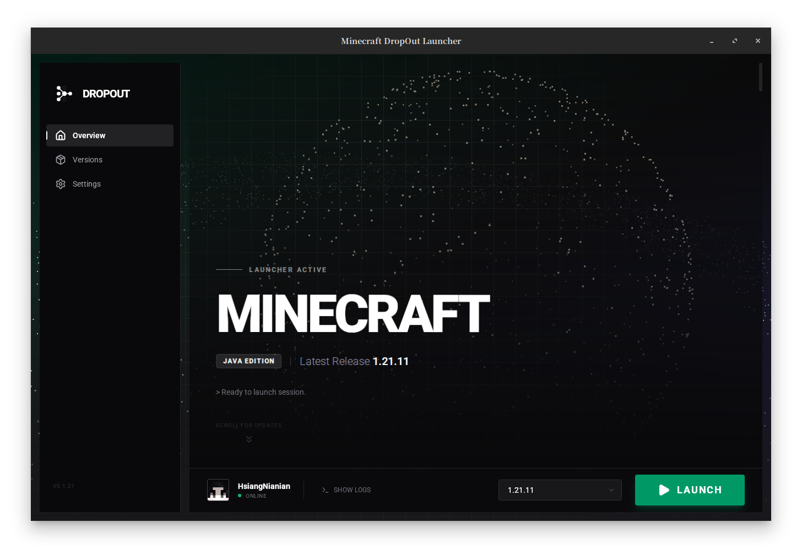

# Drop*O*ut

English | [中文](README.CN.md)

[](https://app.fossa.com/projects/git%2Bgithub.com%2FHsiangNianian%2FDropOut?ref=badge_small)
[](https://github.com/pre-commit/pre-commit)
[](https://results.pre-commit.ci/latest/github/HsiangNianian/DropOut/main)
[](https://github.com/astral-sh/ruff)
[](https://github.com/HydroRoll-Team/DropOut/actions/workflows/codeql.yml)
[](https://github.com/HydroRoll-Team/DropOut/actions/workflows/dependabot/dependabot-updates)
[](https://github.com/HydroRoll-Team/DropOut/actions/workflows/release.yml)
[](https://github.com/HydroRoll-Team/DropOut/actions/workflows/test.yml)

DropOut is a modern, reproducible, and developer-grade Minecraft launcher.
It is designed not just to launch Minecraft, but to manage Minecraft environments as deterministic, versioned workspaces.

Built with Tauri v2 and Rust, DropOut delivers native performance and minimal resource usage, paired with a modern reactive web UI built with React 19, Shadcn UI, and Tailwind CSS 4.

> Minecraft environments are complex systems.
> DropOut treats them like software projects.

<div align="center">
   
</div>

## Why DropOut?

Most Minecraft launchers focus on getting you into the game.
DropOut focuses on keeping your game stable, debuggable, and reproducible.

- Your instance worked yesterday but broke today?  
→ DropOut makes it traceable.

- Sharing a modpack means zipping gigabytes?  
→ DropOut shares exact dependency manifests.

- Java, loader, mods, configs drift out of sync?  
→ DropOut locks them together.

This launcher is built for players who value control, transparency, and long-term stability.

## Features

- **High Performance**: Built with Rust and Tauri for minimal resource usage and fast startup times.
- **Modern Industrial UI**: A clean, distraction-free interface designed with **React 19**, **Shadcn UI**, and **Tailwind CSS 4**.
- **Microsoft Authentication**: Secure login support via official Xbox Live & Microsoft OAuth flows (Device Code Flow).
- **Mod Loader Support**:
  - **Fabric**: Built-in installer and version management.
  - **Forge**: Support for installing and launching Forge versions.
- **Java Management**:
  - Automatic detection of installed Java versions.
  - Built-in downloader for Adoptium JDK/JRE.
- **GitHub Integration**: View the latest project updates and changelogs directly from the launcher home screen.
- **Game Management**:
  - Complete version isolation.
  - Efficient concurrent asset and library downloading.
  - Customizable memory allocation and resolution settings.

## Roadmap

Check our full roadmap at: <https://roadmap.sh/r/minecraft-launcher-dev>

- [X] **Account Persistence** — Save login state between sessions
- [X] **Token Refresh** — Auto-refresh expired Microsoft tokens
- [X] **JVM Arguments Parsing** — Full support for `arguments.jvm` and `arguments.game` parsing
- [X] **Java Auto-detection & Download** — Scan system and download Java runtimes
- [X] **Fabric Loader Support** — Install and launch with Fabric
- [X] **Forge Loader Support** — Install and launch with Forge
- [X] **GitHub Releases Integration** — View changelogs in-app
- [ ] **Instance/Profile System** — Multiple isolated game directories with different versions/mods
- [ ] **Multi-account Support** — Switch between multiple accounts seamlessly
- [ ] **Custom Game Directory** — Allow users to choose game files location
- [ ] **Launcher Auto-updater** — Self-update mechanism via Tauri updater plugin
- [ ] **Mods Manager** — Enable/disable mods directly in the launcher
- [ ] **Import from Other Launchers** — Migration tool for MultiMC/Prism profiles

## Installation

Download the latest release for your platform from the [Releases](https://github.com/HsiangNianian/DropOut/releases) page.

| Platform       | Files                   |
| -------------- | ----------------------- |
| Linux x86_64   | `.deb`, `.AppImage` |
| Linux ARM64    | `.deb`, `.AppImage` |
| macOS ARM64    | `.dmg`                |
| Windows x86_64 | `.msi`, `.exe`      |
| Windows ARM64  | `.msi`, `.exe`      |

## Building from Source

### Prerequisites

1. **Rust**: Install from [rustup.rs](https://rustup.rs/).
2. **Node.js** & **pnpm**: Used for the frontend dependencies.
3. **System Dependencies**: Follow the [Tauri Prerequisites](https://v2.tauri.app/start/prerequisites/) for your OS.

### Steps

1. **Clone the repository**

   ```bash
   git clone https://github.com/HsiangNianian/DropOut.git
   cd DropOut
   ```

2. **Install Dependencies**

   ```bash
   pnpm install
   ```

3. **Run in Development Mode**

   ```bash
   # This will start the frontend server and the Tauri app window
   cargo tauri dev
   ```

4. **Build Release Version**

   ```bash
   cargo tauri build
   ```

   The executable will be located in `src-tauri/target/release/`.

## Contributing

DropOut is built with long-term maintainability in mind.
Contributions are welcome, especially in these areas:

- Instance system design
- Mod compatibility tooling
- UI/UX improvements
- Cross-launcher migration tools

Standard GitHub workflow applies:
fork → feature branch → pull request.

## License

Distributed under the MIT License. See `LICENSE` for more information.

[](https://app.fossa.com/projects/git%2Bgithub.com%2FHsiangNianian%2FDropOut?ref=badge_shield&issueType=license)
[](https://app.fossa.com/projects/git%2Bgithub.com%2FHsiangNianian%2FDropOut?ref=badge_shield&issueType=security)

[](https://app.fossa.com/projects/git%2Bgithub.com%2FHsiangNianian%2FDropOut?ref=badge_large)
