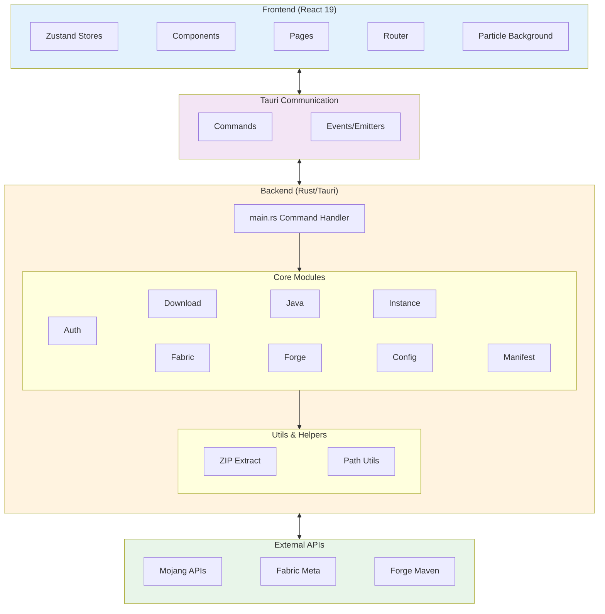

# Architecture

DropOut is built with a modern tech stack designed for performance, security, and cross-platform compatibility.

## Technology Stack

### Backend (Rust)
- **Framework**: Tauri v2
- **Language**: Rust (Edition 2021)
- **Async Runtime**: Tokio
- **HTTP Client**: reqwest with native-tls

### Frontend (React)
- **Framework**: React 19
- **State Management**: Zustand
- **Router**: React Router v7
- **Styling**: Tailwind CSS 4
- **Build Tool**: Vite (with Rolldown)
- **Package Manager**: pnpm

### Documentation
- **Framework**: Fumadocs with React Router v7
- **Content**: MDX files
- **Styling**: Tailwind CSS 4

## System Architecture



## Core Components

### Frontend State Management

DropOut uses **Zustand** for global state management:

```typescript
// models/auth.ts
import { create } from "zustand";

interface AuthState {
  account: Account | null;
  loginMode: LoginMode | null;
  // ...
  setAccount: (account: Account | null) => void;
}

export const useAuthStore = create<AuthState>((set) => ({
  account: null,
  loginMode: null,
  setAccount: (account) => set({ account }),
  // ...
}));
```

**Key Stores:**
- `models/auth.ts`: Authentication state and login flow
- `models/settings.ts`: Launcher settings and Java detection
- `models/instance.ts`: Instance management
- `stores/game-store.ts`: Game running state status
- `stores/logs-store.ts`: Game log stream management
- `stores/ui-store.ts`: UI state (toasts, modals, active view)

### Backend Architecture

#### Command Pattern
All Tauri commands follow this structure:

```rust
#[tauri::command]
async fn command_name(
    window: Window,
    state: State<'_, SomeState>,
    param: Type,
) -> Result<ReturnType, String> {
    emit_log!(window, "Status message");
    // Async logic
    Ok(result)
}
```

#### Event Communication

**Rust → Frontend (Progress Updates):**
```rust
window.emit("launcher-log", "Downloading...")?;
window.emit("download-progress", progress_struct)?;
```

**Frontend → Rust (Commands):**
```typescript
import { invoke } from "@tauri-apps/api/core";
const result = await invoke("start_game", { versionId: "1.20.4" });
```

### Core Modules

#### Authentication (`core/auth.rs`)
- **Microsoft OAuth 2.0**: Device Code Flow
- **Offline Authentication**: Local UUID generation
- **Token Management**: Refresh token storage and auto-refresh
- **Xbox Live Integration**: Full authentication chain

**Authentication Flow:**
1. Device Code Request → MS Token
2. Xbox Live Authentication
3. XSTS Authorization
4. Minecraft Token Exchange
5. Profile Fetching

#### Downloader (`core/downloader.rs`)
- **Concurrent Downloads**: Configurable thread pool
- **Resume Support**: `.part` and `.part.meta` files
- **Multi-segment Downloads**: Large files split into chunks
- **Checksum Verification**: SHA1/SHA256 validation
- **Progress Tracking**: Real-time events to frontend

#### Java Management (`core/java.rs`)
- **Auto-detection**: Scans system paths
- **Adoptium Integration**: Download JDK/JRE on-demand
- **Catalog Caching**: 24-hour cache for version lists
- **Installation**: Extracts to app data directory
- **Cancellation**: Atomic flag for download cancellation

#### Fabric Support (`core/fabric.rs`)
- **Meta API Integration**: Fetch loader versions
- **Profile Generation**: Creates version JSON
- **Library Resolution**: Maven artifact handling

#### Forge Support (`core/forge.rs`)
- **Installer Execution**: Runs Forge installer
- **Profile Parsing**: Extracts install profile
- **Library Management**: Handles Forge-specific libraries

#### Instance System (`core/instance.rs`)
- **Isolation**: Separate directories per instance
- **Configuration**: Per-instance settings
- **Mod Management**: Instance-specific mods
- **Version Locking**: Reproducible environments

#### Version Management
- **Manifest Parsing** (`manifest.rs`): Mojang version manifest
- **Inheritance System** (`version_merge.rs`): Parent version merging
- **Game Version** (`game_version.rs`): JSON parsing and validation
- **Rules Engine** (`rules.rs`): OS/feature conditional logic

### File Structure

```
~/.local/share/com.dropout.launcher/  (Linux)
~/Library/Application Support/com.dropout.launcher/  (macOS)
%APPDATA%/com.dropout.launcher/  (Windows)
├── versions/
│   └── <version_id>/
│       ├── <version_id>.json
│       ├── <version_id>.jar
│       └── natives/
├── libraries/
│   └── <maven-path>/
├── assets/
│   ├── indexes/
│   └── objects/
├── instances/
│   └── <instance_name>/
│       ├── mods/
│       ├── config/
│       └── saves/
├── java/
│   └── <version>/
├── config.json
└── accounts.json
```

## Data Flow

### Game Launch Sequence

1. **Frontend**: User clicks "Launch Game"
2. **Command**: `start_game(instance_id, version_id)` invoked
3. **Backend Processing**:
   - Load version JSON (with inheritance)
   - Resolve all libraries
   - Download missing assets
   - Extract native libraries
   - Build classpath
   - Construct JVM arguments
   - Replace placeholders
4. **Process Spawn**: Launch Java with arguments
5. **Stream Logs**: Emit stdout/stderr to frontend
6. **Monitor**: Track game process status

### Download Flow

1. **Queue Creation**: List of files to download
2. **Concurrent Processing**: Semaphore-limited threads
3. **Resume Check**: Verify existing `.part` files
4. **Download**: Multi-segment for large files
5. **Verification**: Checksum validation
6. **Progress Events**: Real-time updates to UI
7. **Completion**: Move from `.part` to final location

### Authentication Flow

1. **Device Code Request**: Get user code + device code
2. **User Authorization**: User visits URL and enters code
3. **Token Polling**: Frontend polls for completion
4. **Token Exchange**: MS token → Xbox → XSTS → Minecraft
5. **Profile Fetch**: Get username and UUID
6. **Storage**: Save account with refresh token
7. **Auto-refresh**: Background token refresh on expiry

## Platform-Specific Considerations

### Linux
- Uses GTK WebView (`webkit2gtk`)
- System Java detection from `/usr/lib/jvm`
- Desktop file integration

### macOS
- Uses system WebKit
- App bundle structure
- Keychain integration for secure storage

### Windows
- Uses WebView2 runtime
- Registry Java detection
- MSI installer support
- No console window in release builds

## Performance Optimizations

- **Concurrent Downloads**: Parallel asset/library downloads
- **Lazy Loading**: Load version manifests on-demand
- **Caching**: Java catalog, version manifests
- **Native Code**: Rust for CPU-intensive operations
- **Async I/O**: Tokio for non-blocking operations

## Security Features

- **Token Encryption**: Secure storage of auth tokens
- **HTTPS Only**: All external API calls
- **Checksum Validation**: File integrity verification
- **Sandboxed Execution**: Tauri security model
- **No Arbitrary Code**: No eval or dynamic code execution
